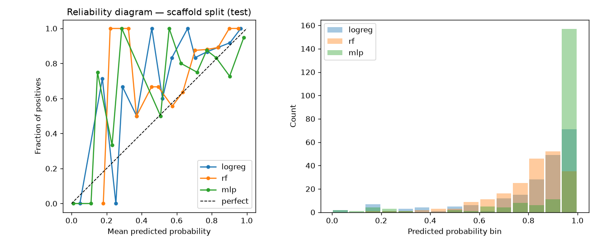

# BBBP under a scaffold split, with calibrated uncertainty

Blood–brain-barrier permeability prediction (MoleculeNet **BBBP**, Wu et al. 2018)
done the rigorous way: a **Murcko scaffold-disjoint 80/10/10 split** (implemented
from scratch with RDKit), three sklearn models on ECFP+MACCS fingerprints, and
**calibration** (ECE, Brier score, reliability diagrams) reported per model —
plus the honest control most demos skip: the *same* models under a *random*
split, so we can **quantify how much random splitting inflates the numbers**.

## Novelty claim

1. **Scaffold-disjoint evaluation.** Most BBBP demos use random splits, which leak
   near-duplicate chemotypes across train/test and inflate AUROC. Here every
   Bemis–Murcko scaffold lives in exactly one split (verified: 0 overlap).
2. **Calibration, not just ranking.** AUROC/AUPRC are reported alongside Expected
   Calibration Error, Brier score, and per-model reliability-diagram data —
   because a permeability model whose 0.9 doesn't mean 90% is dangerous to trust.
3. **The inflation is measured, not asserted.** Random-minus-scaffold gap:
   **+0.09 to +0.16 AUROC** (and balanced accuracy collapses 0.85–0.87 → 0.55–0.68).
4. **Honest null on deep learning.** A minimal message-passing GNN in pure
   PyTorch CPU (3 and 4 layers) was trained on the same scaffold split and
   **lost to fingerprints** (AUROC 0.63–0.69 vs 0.84) — the expected result on
   2k molecules, reported rather than buried.

## How to run

```bash
python -m venv venv && source venv/bin/activate
pip install -r requirements.txt
curl -o data/BBBP.csv https://deepchemdata.s3-us-west-1.amazonaws.com/datasets/BBBP.csv
python -m src.run --data data/BBBP.csv --out results/     # ~35 s on CPU
python -m src.gnn_run --data data/BBBP.csv --out results/  # optional MPNN honesty check (~2 min)
```

## Results (real run, seed 42, n = 2050 compounds, 76.4% positive)

Scaffold split: 1640 / 205 / 205 compounds; unique scaffolds 693 / 205 / 205;
scaffold overlap between any two splits: **0**.

### Scaffold split (test)

| model  | AUROC | AUPRC | acc. | bal. acc. | ECE   | Brier |
|--------|-------|-------|------|-----------|-------|-------|
| RF     | 0.843 | 0.979 | 0.873| 0.549     | 0.088 | 0.089 |
| LogReg | 0.819 | 0.974 | 0.888| 0.677     | 0.079 | 0.093 |
| MLP    | 0.762 | 0.958 | 0.902| 0.645     | 0.065 | 0.087 |
| MPNN (3-layer) | 0.634 | 0.930 | 0.868 | 0.566 | 0.102 | 0.114 |
| MPNN (4-layer, bigger) | 0.685 | 0.949 | 0.859 | 0.541 | 0.091 | 0.108 |

### Random split (test) — the same models, same seed

| model  | AUROC | AUPRC | acc. | bal. acc. | ECE   | Brier |
|--------|-------|-------|------|-----------|-------|-------|
| RF     | 0.936 | 0.977 | 0.912| 0.854     | 0.116 | 0.083 |
| LogReg | 0.911 | 0.958 | 0.893| 0.875     | 0.090 | 0.090 |
| MLP    | 0.921 | 0.956 | 0.917| 0.871     | 0.061 | 0.071 |

### Random-minus-scaffold gap (the inflation)

| model  | ΔAUROC | ΔAUPRC | Δbal.acc. | ΔECE   | ΔBrier |
|--------|--------|--------|-----------|--------|--------|
| LogReg | +0.092 | −0.016 | +0.198    | +0.011 | −0.002 |
| RF     | +0.094 | −0.003 | +0.305    | +0.028 | −0.007 |
| MLP    | **+0.159** | −0.002 | +0.225 | −0.003 | −0.015 |

Read: random splitting inflates AUROC by roughly **a tenth of a point** while
leaving AUPRC nearly unchanged (the 76%-positive base rate props it up).
The dramatic gap is in **balanced accuracy**: models that look near-perfect on
the minority class under a random split (0.85–0.87) are barely above chance on
novel scaffolds (0.55–0.68). Calibration is middling everywhere: best ECE is
the MLP's 0.061–0.065; RF is the worst-calibrated model under both splits.



Plot-ready per-bin data: `results/reliability_{scaffold,random}_{logreg,rf,mlp}.csv`.

## Layout

```
src/
  split.py        Murcko scaffold splitting + overlap diagnostics
  features.py     ECFP (Morgan 1024) + MACCS featurization
  models.py       RF / LogReg / MLP zoo, light valid-set tuning
  calibration.py  ECE, Brier, reliability-curve data + diagram plotting
  gnn.py          minimal pure-torch MPNN (honesty-check experiment)
  run.py          main benchmark: both splits, metrics, CSVs, plots
  gnn_run.py      MPNN training entry point
results/          committed demo artifacts (metrics, gaps, reliability data+PNGs)
```

## Limitations

- Single seed (42), single dataset (n=2050); no confidence intervals — treat
  gaps as indicative, not definitive.
- Scaffold test set happens to be positive-heavy (89% vs 76% overall), which
  props up scaffold-split AUPRC; AUPRC gaps should be read with that in mind.
- One RDKit-unparsable-by-default molecule was kept via non-sanitized parsing
  (documented in BUILD-NOTES.md).
- The MPNN is deliberately minimal (atom features only, no bond features,
  mean pooling); it is a baseline honesty check, not a serious architecture
  search. Hyperparameter tuning was light by design.
- ECE uses 15 equal-width bins; with n=205 test points, low-probability bins
  are sparse and noisy (visible in the reliability diagram).
